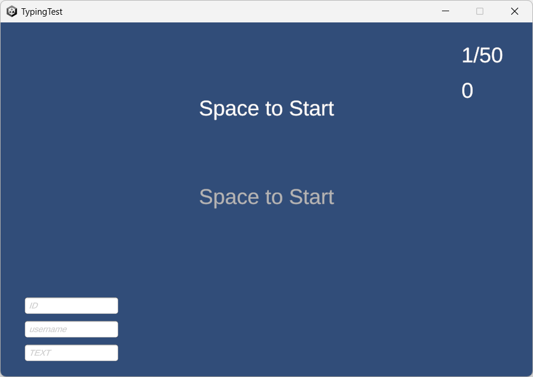

# TypingTest
フィロ4の研究
同じ文字列を繰り返しタイピングする際のパフォーマンス変化を調べます。

## 使い方
まずこのプロジェクトをCloneしたりZIPでdownloadしたりしてローカルにおいてください。

次に、``TypingTest/TypingTest.exe``を実行します。

するとこのようなソフトウェアが起動します。

左下に情報を入力して、Spaceキーを押して測定開始です。

- ID：測定の識別用IDです。測定の度に変更してください。基本的にはxx1,xx2という風な連番にするといいと思います。
- username：ユーザーの名前を入力してください。複数の被験者がいる想定で用意したものです。
- text：測定する文字列です。ここに入力した文字列をひたすらタイピングし続けることになります。

50回文字列をタイピングすると終了です。
測定結果は自動で``TypingTest/TypingTest_Data/SaveData/``に``{ID}_{username}_{text}.json``という名前のJSONファイルで保存されます。

続けて測定を行う場合は、ID（必要があればusername、text）を変更してSpaceキーを押すと再度測定を開始できます。
指が疲れるので連続して測定する場合は間隔を開けたほうがよさそうです。
